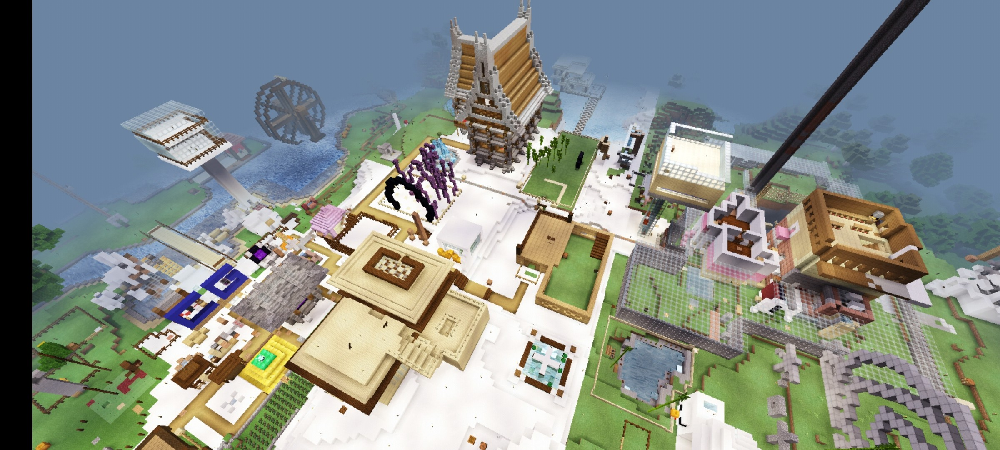
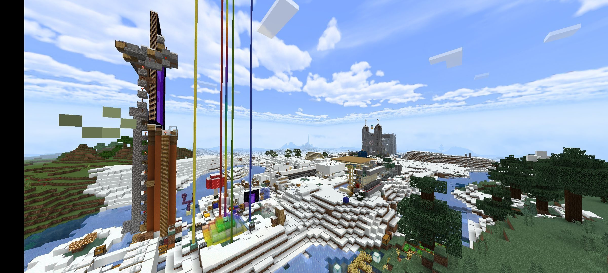
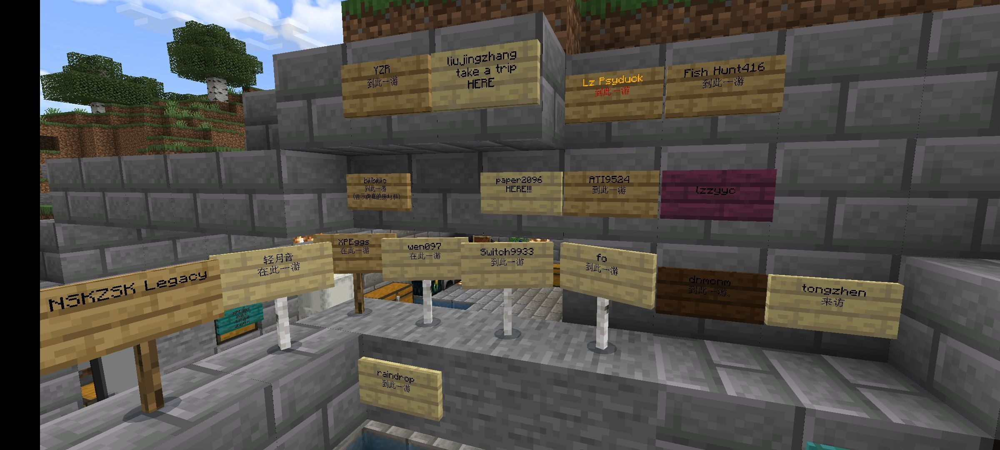
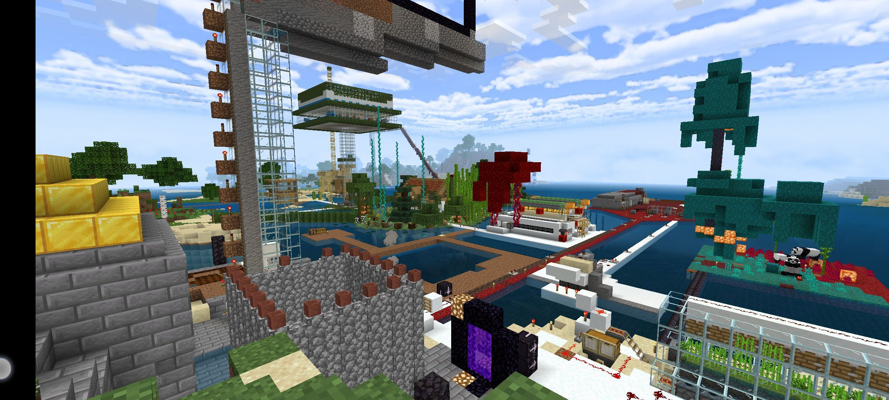
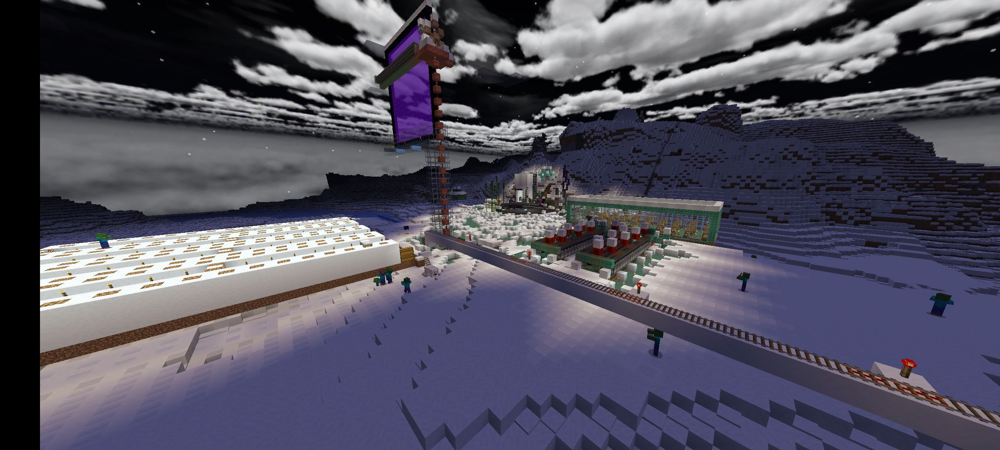
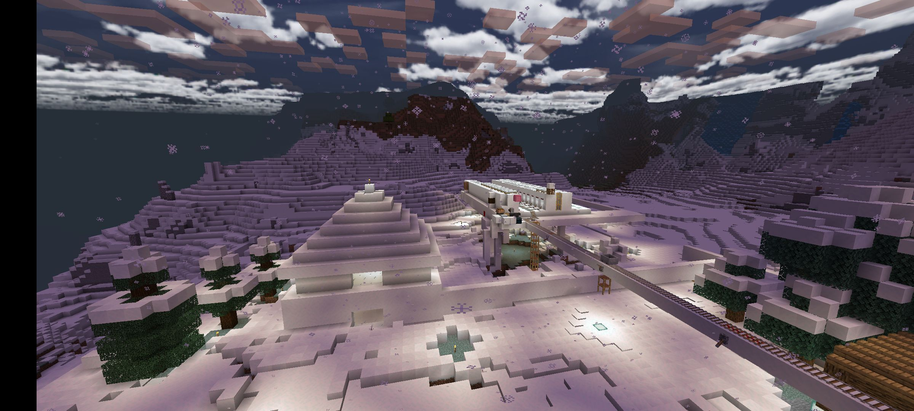
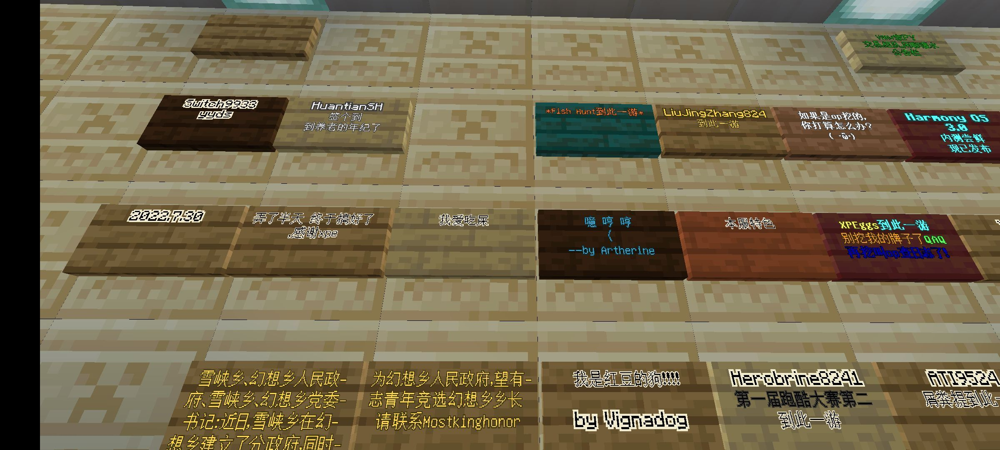
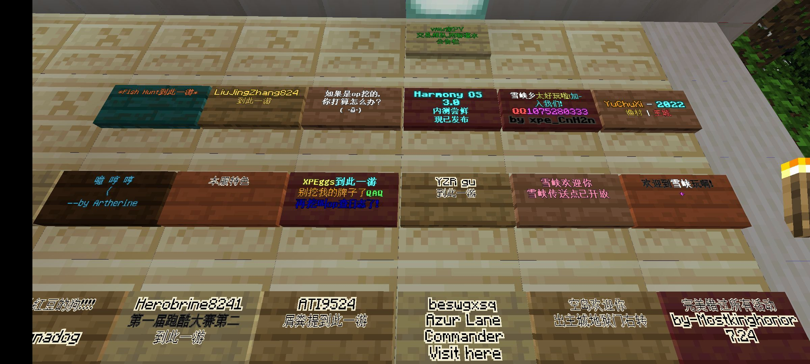

# 星落编年史：🌌星空下的你和我

> *“在这个由 0 和 1 构成的无尽世界里，唯有我们的记忆是真实的。”* —— 某位不愿透露姓名的 Arch 用户

---

## 📄 目录

- [零、序言：](#序言)

- [壹、起源：一切的开始之前](#0x00)

- [贰、第一周目：](#0x01)

---

## <a id="序言"></a> ⏰ 零、序言

> **Author: [snowdropQwQ]**
>
> **Start Date: 2026-01-01**

我们终有一天会消失，但这份历史也许会在互联网上飘荡，直到宇宙结束的那一天...

```bash
sudo systemctl start stardrop.service # 服务器启动中...
```

---

## <a id="0x00"></a> ❄️壹、起源：一切的开始之前

<details>
    <summary>注：本段非服务器正史，请酌情阅读</summary>

### CubeGarden - 雪峡乡

- `2020.4.3` 小学五年级的*snowdropQwQ*网课时加入了一个叫**CubeGarden**的服务器

    - 当时她还叫*XPEggs*

- `2020.4.5` 一个叫**雪峡乡**的小镇在基岩版分服上建立（CubeGarden S5E3）

- `2020.5.12` 小学毕业的*raindropQwQ*也加入了**CubeGarden**与**雪峡乡**

- `2020.?.?` *snowdropQwQ*成为了镇长...?

<details>
    <summary>CubeGarden S5E3</summary>

</details>

<details>
    <summary>Pigeon Hub Pro S1</summary>

<blockquote>主服发生了一些事件，于是基岩版管理员单独分离出来了叫Pigeon Hub Pro的服务器</blockquote>

</details>

<details>
    <summary>Pigeon Hub Pro S2 (114514.online)</summary>


</details>

<details>
    <summary>Pigeon Hub Pro S3</summary>

</details>

<details>
    <summary>Pigeon Hub Pro S4</summary>



</details>

就这样，三年过去了，雪峡乡一度是服务器中最繁荣的小镇

只是，所有人都长大了，服务器也渐渐冷了下来...
</details>

### StarryEpic
